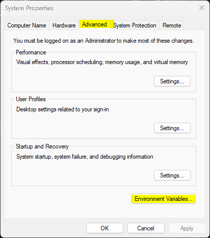
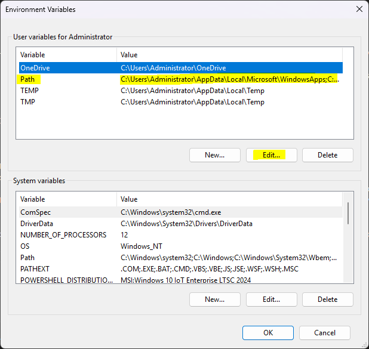
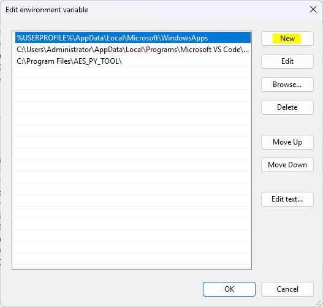
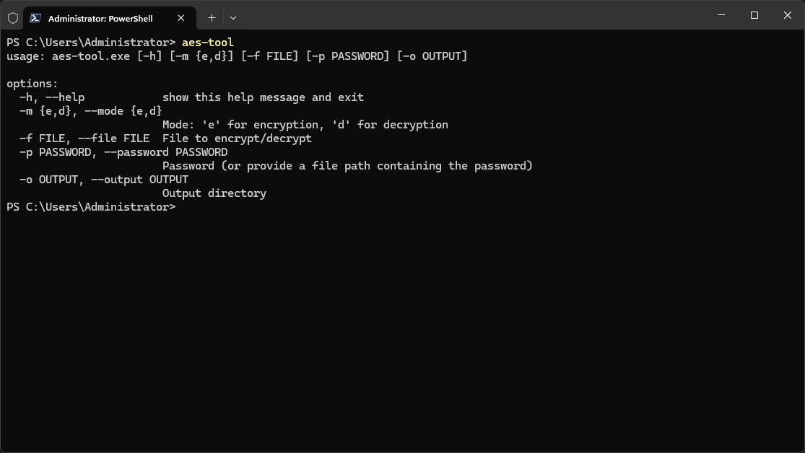

# AEScrypt_Python
AEScrypt windows terminal tool develop with python. Current AEScrypt software is license based for windows user. So, I develop it for my personal use.

## About New version

<ul>
  <li>Dynamic buffer size to adjust with system requirment. So, it will help you to achieve the best performance while encrypt the file.</li>
  <li>Make more secure. You have to use same tool to encrypt and decrypt your file.</li>
  <li>Fix some bugs. </li>
  <li>Add progress bar.</li>
</ul>

## Usages

1. Encryption:

```bash
aes-tool.exe -m e -f ./weights.zip -p ./AEScrypt_Python/src/pass.txt -p ./pass.txt -o ./
```

2. Decryption:

```bash
aes-tool.exe -m d -f ./weights.zip.aes -p ./pass.txt -o ./
```

## Tool

You can download this tool's binary file from <a href="https://drive.google.com/drive/folders/1f-4FB7cmBeaqILe8Ey3wUIWYuNkAvdVP?usp=sharing">here</a>.

## Setup

<br>Download This zip file and extract it. Now, move that folder to the `Program Files`. Default it is in `C:` drive.<br>
Now move open `Edit the system environment variables` then follow those images

1. Go `Advanced` tab and click `Environment variables...`

</img>

2. select `Path` mark on image. and click `Edit`

</img>

3. Click `New` now paste the `AES_PY_TOOL` folder path where you stored it. in my case see the third line. Now, click `OK` and click `OK` to close the program.

</img>

4. Open `Powershell` or `Windows Terminal` then type `aes-tool.exe`. You will see the manual page.

</img>

5. Your all done :)