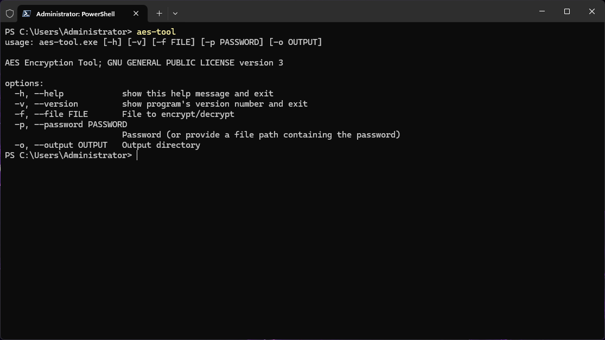

# AEScrypt_Python
AEScrypt windows terminal tool develop with python. Current AEScrypt software is license based for windows user. So, I develop it for my personal use. If there any buffer issue for large file like more than 100MB. I will fix it and update here. Future i will add `bufferSize` option that will prevent this issue.


## Usages

1. Encryption:

```bash
./AEScrypt_Python/src/dist/aes-tool.exe -m e -f ./weights.zip -p ./AEScrypt_Python/src/pass.txt 
```
You can type direct password on `-p` option. But best way is use a file to keep secret. Another point you can use `-m`, `-f`, `-p` and `-o` as `--option`, `--filename`, `--password` and `--output` respectively.<br>
Use `-o` <br>

2. Decryption:

```bash
./AEScrypt_Python/src/dist/aes-tool.exe -m d -f ./weights.zip.aes -p ./AEScrypt_Python/src/pass.txt -o ./AEScrypt_Python/src/
```
Now decrypted file will stored in specified directory in `-o` option instead of current directory. If you not specify the output path it will saved in current directory. 

## Manual

usage: `aes-tool.exe [-h] [-m OPTION] [-f FILENAME] [-p PASSWORD] [-o OUTPUT]`

options:<br>
  `-h` `--help`: show this help message and exit<br>
  `-m`: OPTION, `--option`: OPTION : encryption: `e` or decryption: `d`<br>
  `-f`: FILENAME, `--filename`:FILENAME : .aes for decryption and others for encryption do not use folder make folder as copressed file.<br>
  `-p`: PASSWORD, `--password` : PASSWORD : try to give strong password, use a text file with fully qualified path for security.<br>
  `-o` OUTPUT, `--output OUTPUT`: specify fully qualified output path and use double qoute for better input.<br>

  ## Tools
You can download this tools from <a href="https://drive.google.com/drive/folders/1f-4FB7cmBeaqILe8Ey3wUIWYuNkAvdVP?usp=sharing">here</a>.
<br>Download This zip file. Now, move that folder to the `Program Files`. Default it is in `C:` drive.<br>
Now move open `Edit the system environment variables` then follow those images

1. Go `Advanced` tab and click `Environment variables...`

</img>

2. select `Path` mark on image. and click `Edit`

</img>

3. Click `New` now paste the `AES_PY_TOOL` folder path where you stored it. in my case see the third line. Now, click `OK` and close the program.

</img>

4. Open `Powershell` or `Windows Terminal` then type `aes-tool.exe`. You will see this.

</img>

5. Your all done :)