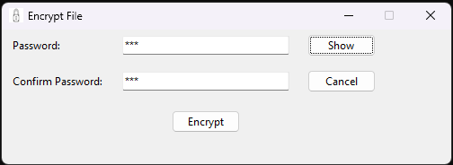
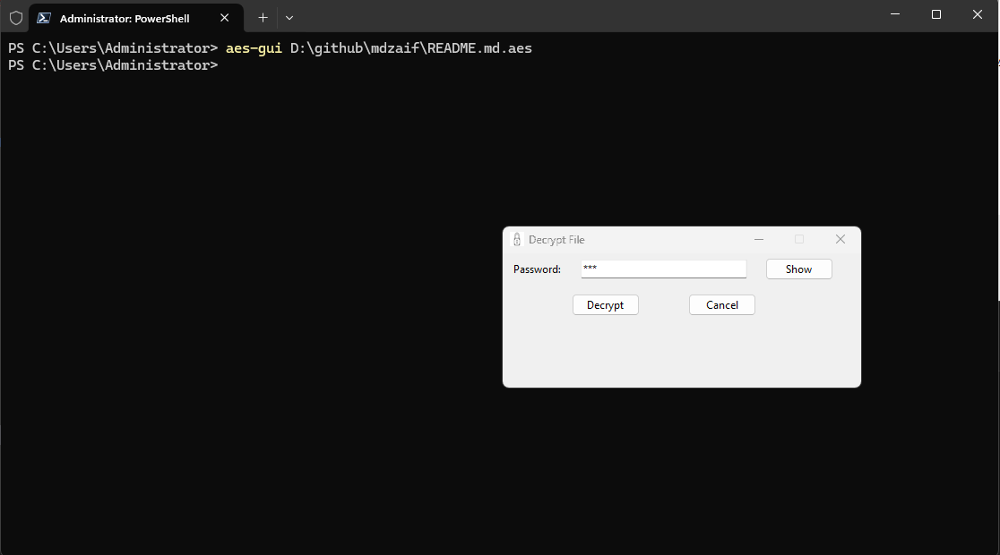
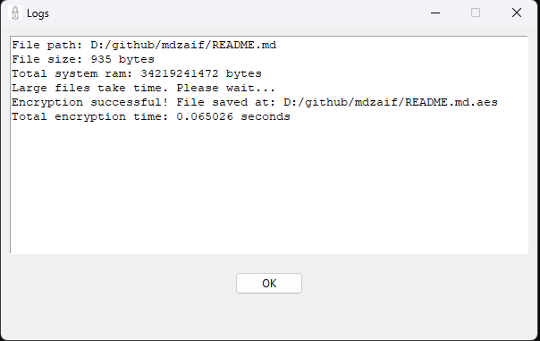
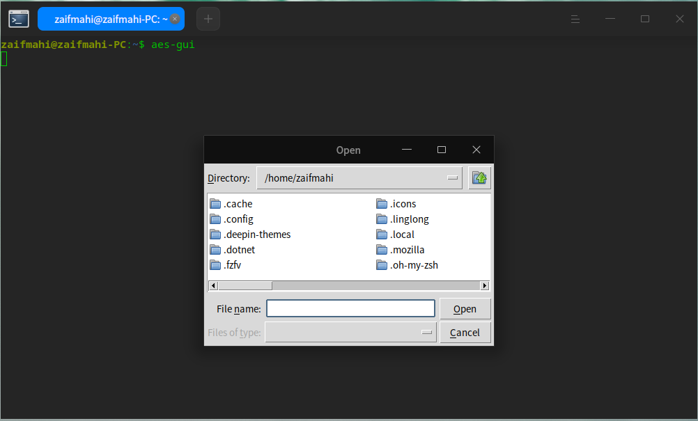
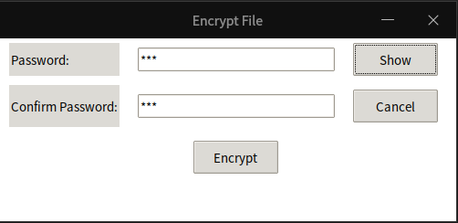
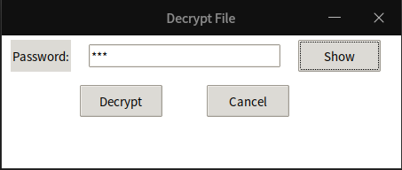
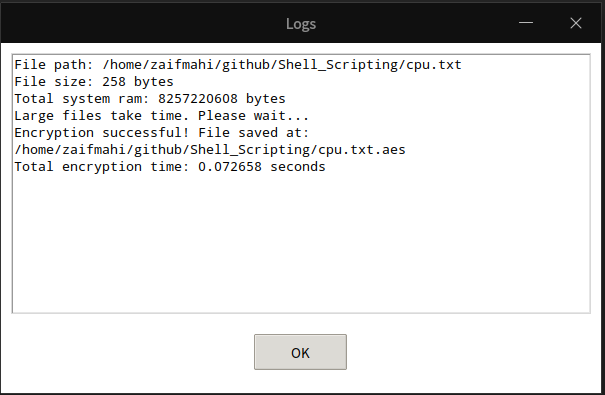

# AEScrypt_Python
AEScrypt windows terminal tool develop with python. Current AEScrypt software is license based for windows user. So, I develop it for my personal use.

## About New version

<ul>
  <li>Add gui version</li>
  <li>Remove mode arguments from terminal tools</li>
</ul>

## Usages

From Newer version(v1.2.0):

1. Encryption:

```bash
aes-tool.exe -f ./weights.zip -p ./AEScrypt_Python/src/pass.txt -p ./pass.txt -o ./
```

2. Decryption:

```bash
aes-tool.exe -f ./weights.zip.aes -p ./pass.txt -o ./
```

Older version(1.1.0 or less):

1. Encryption:

```bash
aes-tool.exe -m e -f ./weights.zip -p ./AEScrypt_Python/src/pass.txt -p ./pass.txt -o ./
```

2. Decryption:

```bash
aes-tool.exe -m d -f ./weights.zip.aes -p ./pass.txt -o ./
```

## Setup

<br>Download This zip file and extract it. Now, move that folder to the `Program Files`. Default it is in `C:` drive.<br>
Now move open `Edit the system environment variables` then follow those images

1. Go `Advanced` tab and click `Environment variables...`

</img>

2. select `Path` mark on image. and click `Edit`

</img>

3. Click `New` now paste the `AES_PY_TOOL` folder path where you stored it. in my case see the third line. Now, click `OK` and click `OK` to close the program.

</img>

4. Open `Powershell` or `Windows Terminal` then type `aes-tool.exe`. You will see the manual page.

</img>

5. Your all done :)

## GUI View

1. Encryption

</img>

You can directly declare the file path shown in decryption section

2. Decryption

</img>

3. Logs




## Linux setup

1. Downlaod binary file from <a href="#assets">here</a>.

2. Then extract it and finally follow those command

```bash
cd  *dowloanded file*  &&\
sudo chmod +x install.sh &&\
./install.sh
```

3. Your all done :)

## GUI View

1. Initial View by terminal

</img>

You can directly declare the file path like:

```bash
aes-gui /file/path
```

2. Encryption

</img>

3. Decryption

</img>

4. Logs

</img>


<p>In Linux, by default you can not find the desktop icon of that application, what you can do just follow those steps:</p><br>

<b> Step 1:</b> Open your terminal and visit this `~/.local/share/applications` directory.

```bash
cd ~/.local/share/applications
```

<b>Step 2:</b> Create a `aesgui.desktop` file.

```bash
nano aesgui.desktop # if you don't have nano you can use vim or any other text editor to open this file
```

<b>Step 3: </b>Copy and paste those line in that file.
```ino
[Desktop Entry]
 Encoding=UTF-8
 Name=AES GUI Tool
 Comment=Encrypt and Decrypt Files
 Exec=$HOME/aes-tool-linuxv1.2.0/aes-gui
 Icon=$HOME/aes-tool-linuxv1.2.0/assets/aes_tool_icon.png
 Categories=Application
 Type=Application
 Terminal=flase
```
<b>Note: </b> Icon will not appear while search because some issue's here.<br>

Now save the file and exit with `Ctrl+S` and `Ctrl+X` press respectively for nano text editor.

<b>Step 4: </b> Open `Menu` or `Launcher` and search this application. You will see like this

</img>


## Assets

<table>
  <thead>
    <tr>
      <th>Platform</th>
      <th>Package</th>
      <th>Version</th>
      <th>Download Link</th>
    </tr>
  </thead>
  <tbody>
    <tr>
      <td rowspan='2'> Windows 10+ </td>
      <td>aes-tool (terminal tool)</td>
      <td>1.1.0</td>
      <td><a href="https://drive.google.com/uc?id=14nd6W5-mQZTtO9aHBYufIZF9pMpfUl4L&export=download">aes-tool-winv1.1.0</a></td>
    </tr>
    <tr>
      <td>aes-tool (GUI & terminal tool)</td>
      <td>1.2.0</td>
      <td><a href="https://drive.google.com/uc?id=14fx--3sq0EpGNAZPaU7MD_WbHMEuLNuU&export=download">aes-tool-winv1.2.0</a></td>
    </tr>
    <tr>
      <td rowspan='2'>Linux (tested on debian based)</td>
      <td>aes-tool (terminal tool)</td>
      <td>1.1.0</td>
      <td><a href="https://drive.google.com/uc?id=19U16UEoRObDu5T-LSQbVQrB7MPNbX7ag&export=download">aes-tool-linux-v1.1.0</a></td>
    </tr>
    <tr>
      <td>aes-tool (GUI & terminal tool)</td>
      <td>1.2.0</td>
      <td><a href="https://drive.google.com/uc?id=1KZhmUhYveCHgmluQfJ3EkoVdNhUx3fCQ&export=download">aes-tool-linuxv1.2.0</a></td>
    </tr>
  </tbody>
</table>
